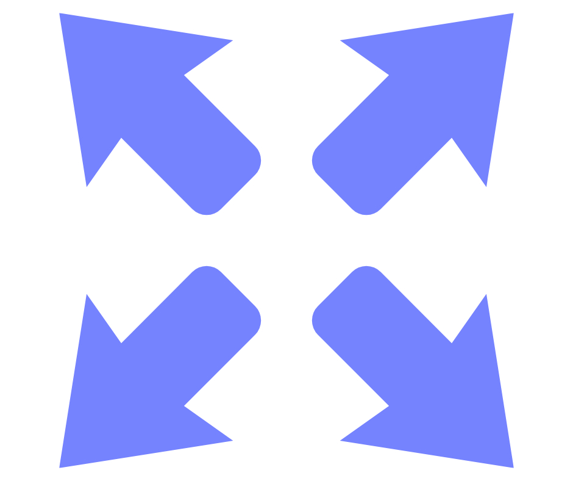

# React Routers

<p align="center"></p>
<h1 align="center">React Routers</h1>
<p align="center">🌠 A React Component for quick configuring route</p>
<p align="center">
<a href="https://github.com/Bert0324/react-routers/blob/main/LICENCE"></a>
<a href="https://www.npmjs.com/package/react-routers"></a>
<a href="https://github.com/Bert0324/react-routers/pulls"></a>
<a href="https://github.com/bert0324/react-routers"></a>
<a href="https://github.com/bert0324/react-routers/fork"></a>
</p>

## ⭐ Features

- Static Routes like [`react-router-config`](https://github.com/ReactTraining/react-router/tree/master/packages/react-router-config)
- Route Guard and `keep-alive` like `Vue`
- Auto Lazy Load
- Easy **prefetch**
- Simple Transition Animation
- Change `document.title` with Configuration
- Tiny Size, unpacked 13KB
- Full Typescript Support

## 🏠 Installation

- `yarn add react-routers`

## 🎠 Example & Playground

```tsx
import { BrowserRouter } from 'react-router-dom';
import { Routers } from 'react-routers';

const App = () => {
    return (
        <BrowserRouter basename='prefix'>
            <Routers
                routers={[
                    {
                        path: '/page',
                        Component: async () => (await import('./Component')).Component
                    }
                ]}
            />
        </BrowserRouter>
    )
}
```

A playground of `react-routers` in [HERE](https://stackblitz.com/edit/react-routers-demo).

## 📑 API

### Props of `Routers`

#### `routers`

The Router configuration, the path in children will be jointed with the path in parent. Its type is as below:

```ts
interface IPageRouter {
    /**
     * route path
     */
    path: string;
    /**
     * document.title, if not set, will use original title in html
     */
    name?: string;
    /**
     * the lazy load Component
     */
    Component?: () => (Promise<ComponentType<any>> | ComponentType<any>);
    /**
     * children configuration
     * - child node will inherit parent node configuration
     * - child node configuration has higher priority than parent node configuration
     */
    children?: IPageRouter[];
    /**
     * triggered before entering route
     * - if return false, deny to enter route\
     * - after `beforeEach`
     */
    beforeRoute?: IBeforeRoute;
    /**
     * triggered after entering route
     * - if return false, deny to enter route
     * - ahead of `afterEach`
     */
    afterRoute?: IAfterRoute;
    /**
     * maintains component state and avoids repeated re-rendering for the route
     * - default is `false`
     * - its priority is higher than `keepAlive` in props
     */
    keepAlive?: boolean;
    /**
     * transition animation
     */
    transition?: ITransition;
    /**
     * the path list to prefetch
     * - parent node prefetch will be append after current node prefetch
     */
    prefetch?: string[];
}
```

#### `fallback`

A fallback react tree to show when a Suspense child (like React.lazy) suspends, and before entering the route. It must be a React Component.

#### `redirect`

redirect path.

#### `beforeEach`

triggered before entering route

- if return false, deny to enter route
- ahead of any `beforeRoute`

#### `afterEach`

triggered after entering route

- if return false, deny to enter route
- after any `afterRoute`

#### `keepAlive`

do maintains component state and avoids repeated re-rendering for each route

- default is `false`

#### `switchRoute`

Do select only one route like `<Switch>`

- default is `true`

#### `transition`

transition animation. Its type is as below:

```ts
type ITransition = {
    /**
     * the css style after matched
     */
    match: CSSProperties;
    /**
     * the css style after unmatched
     */
    notMatch: CSSProperties;
    /**
     * the css style of transition
     */
    trans: CSSProperties;
    /**
     * keep component after unmatched
     * - default is `500`ms
     */
    delay?: number;
};
```

or directly use embedded animation objects.

## `delay`

loading delay

- default is `100`ms

## `prefetchDelay`

how much time delayed to start prefetch after main thread is idle

- default is `0` ms

### Hooks

#### `useActive` & `useDeactive`

The hook triggered when the component's active state has changed.

WHEN DO YOU NEED IT?

- If a component is set as `keepAlive`, and you want to trigger something when the component is activated.

```ts
import { useActive, useDeactive } from 'react-routers';

useActive(() => {
    /* Called when the component is activated. */
});

useDeactive(() => {
    /* Called when the component is deactivated. */
});
```

#### `useParams` & `useRouteMatch`

A wrapped function of [`useParams`](https://reactrouter.com/web/api/Hooks/useroutematch) & [`useRouteMatch`](https://reactrouter.com/web/api/Hooks/useroutematch)

As `react-router` don't have the configuration configured in `react-routers`, if you want to get params in route, you should use this hook.

```ts
import { useParams, useRouteMatch } from 'react-routers';

// /blog/:slug
const { slug } = useParams<{ slug?:string }>(); 
const match = useRouteMatch<{ slug?:string }>();
```

### Embedded Animation

The object which can be put in `transition`, includes `Fade`, `LeftFade`, `RightFade`, `TopFade`, `BottomFade`, `LeftSlide`, `RightSlide`, `TopSlide`, `BottomSlide`.

## 💻 Development

- `yarn`
- `preview=true yarn dev`
- `yarn build`

## 🍧 License

React Routers is [MIT licensed](https://github.com/Bert0324/react-routers/blob/main/LICENCE).
